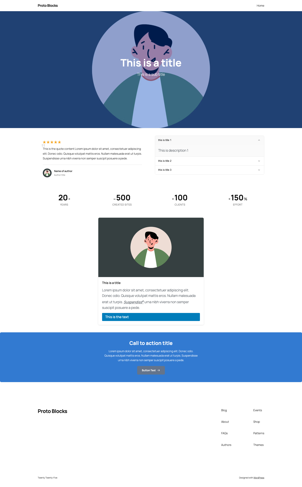
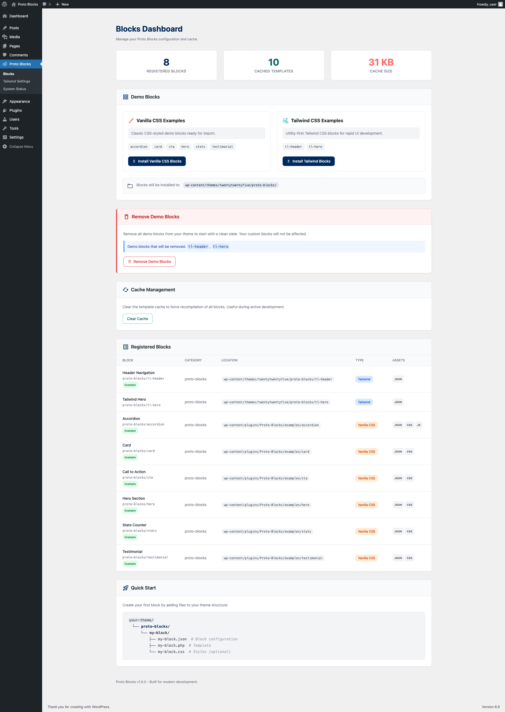
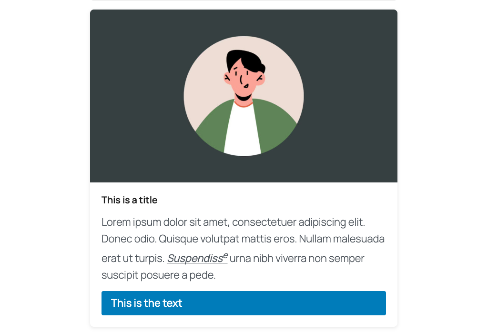
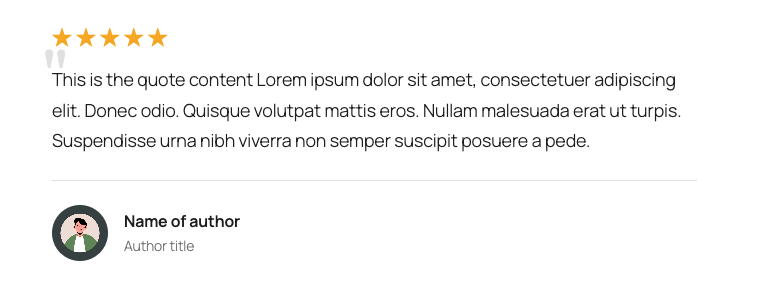
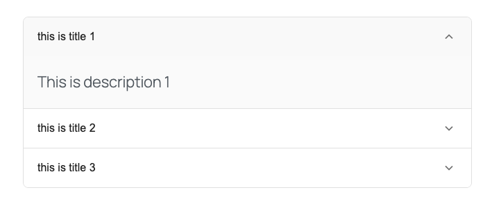
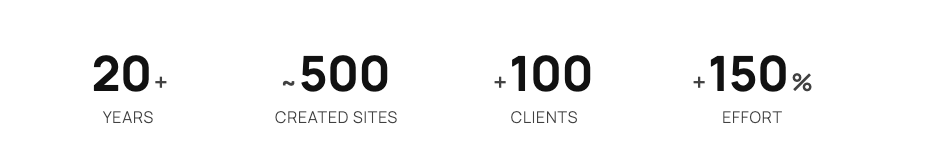
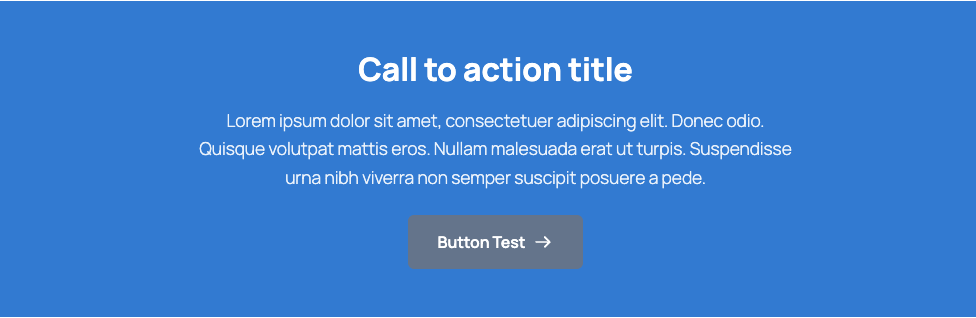

# Proto-Blocks

A next-generation WordPress plugin that enables developers to create Gutenberg blocks using PHP/HTML templates instead of React.

<table>
  <tr>
    <td></td>
    <td></td>
  </tr>
</table>

## Features

- **Single Source of Truth**: Define blocks using a single `block.json` file
- **Template Caching**: Compiled templates are cached for optimal performance
- **Extensible Field Types**: Plugin architecture for custom field types
- **Enhanced Repeater**: Drag-drop reordering, collapse/expand, duplicate, min/max limits
- **Interactivity API Support**: Full support for WordPress Interactivity API directives
- **WP-CLI Commands**: Scaffold, validate, and manage blocks from the command line
- **TypeScript Editor**: Type-safe editor components for better developer experience

## Requirements

- WordPress 6.3+
- PHP 8.0+

## Installation

1. Download or clone this repository to your `wp-content/plugins` directory
2. Run `npm install` to install dependencies
3. Run `npm run build` to build the JavaScript assets
4. Activate the plugin in WordPress admin

## Creating Your First Block

### 1. Create the Block Directory

Create a `proto-blocks` directory in your theme:

```
your-theme/
└── proto-blocks/
    └── card/
        ├── block.json
        ├── template.php
        ├── style.css
        └── preview.png    (optional - block preview screenshot)
```

### 2. Define the Block Schema (block.json)

```json
{
    "$schema": "https://schemas.wp.org/trunk/block.json",
    "apiVersion": 3,
    "name": "proto-blocks/card",
    "title": "Card",
    "category": "proto-blocks",
    "icon": "admin-post",
    "protoBlocks": {
        "version": "1.0",
        "template": "template.php",
        "fields": {
            "title": {
                "type": "text",
                "tagName": "h2"
            },
            "content": {
                "type": "wysiwyg"
            },
            "image": {
                "type": "image"
            }
        },
        "controls": {
            "layout": {
                "type": "select",
                "label": "Layout",
                "default": "vertical",
                "options": [
                    { "key": "vertical", "label": "Vertical" },
                    { "key": "horizontal", "label": "Horizontal" }
                ]
            }
        }
    }
}
```

### 3. Create the Template (template.php)

```php
<?php
/**
 * @var array    $attributes Block attributes.
 * @var string   $content    Inner blocks content.
 * @var WP_Block $block      Block instance.
 */

$layout = $attributes['layout'] ?? 'vertical';
?>

<div class="my-card my-card--<?php echo esc_attr($layout); ?>">
    <?php if (!empty($attributes['image']['url'])) : ?>
        <figure data-proto-field="image">
            " alt="" />
        </figure>
    <?php endif; ?>

    <h2 data-proto-field="title"><?php echo esc_html($attributes['title'] ?? ''); ?></h2>

    <div data-proto-field="content">
        <?php echo wp_kses_post($attributes['content'] ?? ''); ?>
    </div>
</div>
```

## Field Types

### Text Field

```json
{
    "title": {
        "type": "text",
        "tagName": "h2"
    }
}
```

### Image Field

```json
{
    "image": {
        "type": "image",
        "sizes": ["medium", "large"]
    }
}
```

### Link Field

```json
{
    "link": {
        "type": "link",
        "tagName": "a"
    }
}
```

### WYSIWYG Field

```json
{
    "content": {
        "type": "wysiwyg"
    }
}
```

### Repeater Field

```json
{
    "items": {
        "type": "repeater",
        "min": 1,
        "max": 10,
        "itemLabel": "title",
        "collapsible": true,
        "fields": {
            "title": { "type": "text" },
            "content": { "type": "wysiwyg" }
        }
    }
}
```

### Inner Blocks Field

```json
{
    "innerContent": {
        "type": "inner-blocks",
        "allowedBlocks": ["core/paragraph", "core/heading"],
        "template": [["core/paragraph", {}]]
    }
}
```

## Control Types

- `text` - Text input
- `textarea` - Multi-line text input
- `select` - Dropdown selection
- `toggle` - Boolean toggle
- `checkbox` - Boolean checkbox
- `range` - Slider with min/max
- `number` - Numeric input
- `color` - Color picker
- `color-palette` - Color palette selection
- `image` - Image selection from media library
- `radio` - Radio button group

### Conditional Controls

Controls can be conditionally shown based on other control values:

```json
{
    "imagePosition": {
        "type": "select",
        "label": "Image Position",
        "options": [...],
        "conditions": {
            "visible": {
                "layout": ["horizontal"]
            }
        }
    }
}
```

## Template Markup

Proto-Blocks uses special `data-proto-*` attributes to make template elements editable in the WordPress block editor.

### Basic Field Binding

Use `data-proto-field` to bind an element to a field:

```php
<!-- Text field - editable inline -->
<h2 data-proto-field="title"><?php echo esc_html($attributes['title'] ?? ''); ?></h2>

<!-- WYSIWYG field - rich text editing -->
<div data-proto-field="content"><?php echo wp_kses_post($attributes['content'] ?? ''); ?></div>

<!-- Image field - shows replace/remove buttons -->
<figure data-proto-field="image">
    " alt="" />
</figure>

<!-- Link field - editable text with link popover -->
<a href="<?php echo esc_url($attributes['link']['url'] ?? '#'); ?>" data-proto-field="link">
    <?php echo esc_html($attributes['link']['text'] ?? 'Click here'); ?>
</a>
```

### Repeater Fields

Use `data-proto-repeater` for repeater containers:

```php
<ul data-proto-repeater="items">
    <?php foreach ($attributes['items'] ?? [] as $item) : ?>
        <li data-proto-repeater-item>
            <span data-proto-field="title"><?php echo esc_html($item['title'] ?? ''); ?></span>
        </li>
    <?php endforeach; ?>
</ul>
```

### Inner Blocks

Use `data-proto-inner-blocks` for nested block content:

```php
<div class="my-block__content" data-proto-inner-blocks>
    <?php echo $content; ?>
</div>
```

### Important Template Tips

1. **Always output field elements** - Even when empty, output the element with `data-proto-field` so it's editable:

```php
<!-- Good: Always shows editable element -->
<h2 data-proto-field="title"><?php echo esc_html($attributes['title'] ?? ''); ?></h2>

<!-- Bad: Element hidden when empty, can't edit -->
<?php if (!empty($attributes['title'])) : ?>
    <h2><?php echo esc_html($attributes['title']); ?></h2>
<?php endif; ?>
```

2. **Preview detection** - Check if rendering in editor preview:

```php
<?php
// $block is null during editor preview
$is_preview = !isset($block) || $block === null;

// Show placeholder content in editor
if ($is_preview && empty($attributes['title'])) {
    echo '<h2 data-proto-field="title" class="placeholder">Click to add title...</h2>';
}
?>
```

## Frontend JavaScript (Interactivity)

Proto-Blocks supports multiple approaches for adding interactivity to your blocks on the frontend. The WordPress Interactivity API used in the examples is **completely optional** - you can use plain JavaScript, jQuery, or any other approach you prefer.

### Option 1: Plain JavaScript (Recommended for Simple Interactions)

Use a regular JavaScript file for straightforward interactions:

**block.json:**
```json
{
    "viewScript": "file:./view.js"
}
```

**view.js:**
```javascript
document.addEventListener('DOMContentLoaded', function() {
    // Toggle accordion items
    const triggers = document.querySelectorAll('.my-accordion__trigger');

    triggers.forEach(trigger => {
        trigger.addEventListener('click', function() {
            const item = this.closest('.my-accordion__item');
            const isOpen = item.classList.contains('is-open');

            // Close all items
            document.querySelectorAll('.my-accordion__item').forEach(i => {
                i.classList.remove('is-open');
            });

            // Open clicked item (if it wasn't already open)
            if (!isOpen) {
                item.classList.add('is-open');
            }
        });
    });
});
```

### Option 2: ES Modules

Use ES modules for better code organization:

**block.json:**
```json
{
    "viewScriptModule": "file:./view.js"
}
```

**view.js:**
```javascript
// ES module - runs after DOM is ready
const accordions = document.querySelectorAll('.my-accordion');

accordions.forEach(accordion => {
    const items = accordion.querySelectorAll('.my-accordion__item');

    items.forEach(item => {
        const trigger = item.querySelector('.my-accordion__trigger');

        trigger?.addEventListener('click', () => {
            item.classList.toggle('is-open');
        });
    });
});
```

### Option 3: WordPress Interactivity API

The Interactivity API provides declarative, reactive state management:

**block.json:**
```json
{
    "viewScriptModule": "file:./view.js",
    "supports": {
        "interactivity": true
    }
}
```

**template.php:**
```php
<?php
$context = [
    'isOpen' => false,
];
?>
<div
    data-wp-interactive="my-namespace/accordion"
    data-wp-context='<?php echo wp_json_encode($context); ?>'
>
    <button data-wp-on--click="actions.toggle">
        Toggle
    </button>
    <div data-wp-bind--hidden="!context.isOpen">
        Content here...
    </div>
</div>
```

**view.js:**
```javascript
import { store, getContext } from '@wordpress/interactivity';

store('my-namespace/accordion', {
    actions: {
        toggle() {
            const context = getContext();
            context.isOpen = !context.isOpen;
        },
    },
});
```

### When to Use Each Approach

| Approach | Best For |
|----------|----------|
| **Plain JavaScript** | Simple toggles, one-time DOM manipulation, animations |
| **ES Modules** | Better code organization, modern syntax, tree-shaking |
| **Interactivity API** | Complex state, reactive updates, multiple components sharing state |

### Notes

- The demo blocks (Card, Testimonial, Accordion) use the Interactivity API as examples, but this is **not required**
- Plain JavaScript works perfectly fine and may be simpler for basic interactions
- You can even use jQuery if it's already loaded on your site
- Mix and match approaches across different blocks as needed

## Block Preview Screenshots

Proto-Blocks supports custom preview screenshots that appear in the block inserter. Instead of showing "No preview available" or a rendered preview, you can provide a static image that shows exactly how your block looks.

### Adding a Preview Image

Simply add an image file named `preview` to your block folder:

```
your-block/
├── block.json
├── template.php
├── style.css
└── preview.png    ← Your preview screenshot
```

### Supported Formats

- `preview.png` (recommended)
- `preview.jpg`
- `preview.jpeg`
- `preview.webp`

### Recommended Dimensions

- **Width**: 400px (matches the inserter preview viewport)
- **Height**: Proportional to your block's typical appearance
- **Format**: PNG for crisp text and UI elements, JPG/WebP for photographic content

### Example

```
examples/
└── accordion/
    ├── block.json
    ├── template.php
    ├── style.css
    ├── view.js
    └── preview.png    ← Shows accordion in expanded state
```

When users hover over your block in the inserter, they'll see your custom preview image instead of the default "No preview available" message.

### Benefits

- **Visual clarity**: Users immediately see what the block looks like
- **Faster inserter**: No need to render a live preview
- **Design control**: Show the block in its best state (expanded, populated, styled)

## Editor Preview System

Proto-Blocks uses a server-side rendering approach for the block editor. When you edit a block:

1. The PHP template is rendered server-side via AJAX
2. The HTML is sent to the editor
3. `data-proto-field` elements are replaced with React components
4. Changes update attributes and trigger a new preview render

### Preview Refresh Triggers

The preview automatically refreshes when:
- Any **control** value changes (layout, toggles, selects, etc.)
- Initial block load

Field edits (text, images, links) update **inline** without a full preview refresh for better performance.

## Debug Mode

Enable debug mode for detailed logging:

```php
// In wp-config.php or your theme's functions.php
define('PROTO_BLOCKS_DEBUG', true);
```

Debug mode enables:
- PHP error logging for block registration and rendering
- JavaScript console logs for preview updates and attribute changes
- Detailed error messages in AJAX responses

**Note:** Disable debug mode in production for security and performance.

## WP-CLI Commands

```bash
# List all registered blocks
wp proto-blocks list

# Create a new block scaffold
wp proto-blocks create testimonial --title="Testimonial" --fields="quote:wysiwyg,author:text"

# Validate all blocks
wp proto-blocks validate

# Clear template cache
wp proto-blocks cache clear

# Show cache statistics
wp proto-blocks cache stats

# Export a block
wp proto-blocks export card --output=/path/to/export
```

## Block Category

Proto-Blocks registers a custom block category that appears at the **top** of the block inserter for easy access to your custom blocks.

### Default Configuration

- **Title**: "Proto Blocks"
- **Slug**: `proto-blocks`
- **Icon**: `layout` (dashicon)
- **Position**: First in the block inserter

### Customizing the Category

You can customize the category using WordPress filters in your theme's `functions.php` or a custom plugin:

#### Change the Category Title

```php
add_filter('proto_blocks_category_title', function($title) {
    return 'My Custom Blocks';
});
```

#### Change the Category Icon

Use any [WordPress Dashicon](https://developer.wordpress.org/resource/dashicons/) name (without the `dashicons-` prefix):

```php
add_filter('proto_blocks_category_icon', function($icon) {
    return 'star-filled';
});
```

#### Change the Category Slug

```php
add_filter('proto_blocks_category_slug', function($slug) {
    return 'my-blocks';
});
```

**Note:** If you change the slug, update your blocks' `block.json` files to use the new category:

```json
{
    "category": "my-blocks"
}
```

## Extending Proto-Blocks

### Available Hooks

Proto-Blocks provides several hooks for customization:

#### Actions

| Hook | Description | Parameters |
|------|-------------|------------|
| `proto_blocks_init` | Fires after Proto-Blocks is initialized | `$plugin` (Plugin instance) |
| `proto_blocks_registered` | Fires after all blocks are registered | `$blocks` (array of registered block names) |

#### Filters

| Filter | Description | Parameters |
|--------|-------------|------------|
| `proto_blocks_category_title` | Customize category display name | `$title` (string) |
| `proto_blocks_category_icon` | Customize category icon | `$icon` (dashicon name) |
| `proto_blocks_category_slug` | Customize category slug | `$slug` (string) |
| `proto_blocks_paths` | Add custom block discovery paths | `$paths` (array) |
| `proto_blocks_discovered` | Modify discovered blocks | `$blocks` (array) |

### Register Custom Field Type

```php
add_action('proto_blocks_init', function($plugin) {
    $plugin->getFieldRegistry()->register('datepicker', [
        'php_class' => My_Datepicker_Field::class,
        'attribute_schema' => ['type' => 'string', 'default' => ''],
    ]);
});
```

### Add Custom Block Discovery Paths

By default, Proto-Blocks looks for blocks in:
- Your active theme's `proto-blocks/` directory
- Your parent theme's `proto-blocks/` directory (if using a child theme)

Add additional paths:

```php
add_filter('proto_blocks_paths', function($paths) {
    // Add a custom directory in your theme
    $paths[] = get_template_directory() . '/custom-blocks';

    // Add blocks from another plugin
    $paths[] = WP_PLUGIN_DIR . '/my-plugin/blocks';

    return $paths;
});
```

### Modify Discovered Blocks

Filter the list of discovered blocks before registration:

```php
add_filter('proto_blocks_discovered', function($blocks) {
    // Remove a specific block
    unset($blocks['card']);

    // Add a block programmatically
    $blocks['custom'] = '/path/to/custom/block';

    return $blocks;
});
```

### Run Code After Blocks Are Registered

```php
add_action('proto_blocks_registered', function($registeredBlocks) {
    // Log registered blocks
    error_log('Proto-Blocks registered: ' . implode(', ', $registeredBlocks));

    // Perform additional setup
    // ...
});
```

## Development

```bash
# Install dependencies
npm install

# Build for production
npm run build

# Watch for changes during development
npm run start

# Format code
npm run format

# Lint code
npm run lint:js
```

## Demo Blocks

Proto-Blocks includes 6 demo blocks that showcase all available capabilities. These can be installed to your theme via the admin panel to explore and learn from.

### Block Overview

| Block | Purpose | Key Features Demonstrated |
|-------|---------|--------------------------|
| **Card** | Versatile content card | Image field, WYSIWYG, Link field, Conditional controls |
| **Testimonial** | Customer testimonial | Range control (star rating), Toggle controls, Image sizes |
| **Accordion** | Collapsible sections | Repeater field, Interactivity API, Drag-drop reordering |
| **Hero** | Full-width hero section | Inner Blocks, Color control, Color-palette, Radio control, Number control, Image control |
| **Stats** | Statistics counter | Number control, Simple repeater, Range control |
| **CTA** | Call to action | Textarea control, Checkbox control, Radio control |

---

### Card Block



A versatile card with image, title, content, and call-to-action link.

**Fields:**
- `image` (Image) - Featured image with size options
- `title` (Text) - Card heading
- `content` (WYSIWYG) - Rich text body content
- `link` (Link) - Call-to-action button

**Controls:**
- `layout` (Select) - Vertical, Horizontal, or Overlay
- `imagePosition` (Select) - Top, Bottom, Left, Right (conditional - only shows for certain layouts)
- `showLink` (Toggle) - Show/hide call-to-action

**Demonstrates:**
- Image field with multiple size options
- Link field with popover editor
- WYSIWYG rich text editing
- Conditional control visibility
- WordPress block supports (colors, spacing)

---

### Testimonial Block



Customer testimonial with rating and author information.

**Fields:**
- `quote` (WYSIWYG) - Testimonial text
- `authorName` (Text) - Customer name
- `authorTitle` (Text) - Customer title/role
- `authorImage` (Image) - Customer photo

**Controls:**
- `style` (Select) - Default, Bordered, or Filled
- `showAvatar` (Toggle) - Show/hide author photo
- `rating` (Range) - 0-5 star rating
- `showRating` (Toggle) - Show/hide star rating

**Demonstrates:**
- Range control for numeric values
- Multiple toggle controls
- Image field with thumbnail size
- Style variations via select control

---

### Accordion Block



Collapsible content sections with expand/collapse functionality.

**Fields:**
- `items` (Repeater) - List of accordion sections
  - `title` (Text) - Section header
  - `content` (WYSIWYG) - Section content

**Controls:**
- `allowMultiple` (Toggle) - Allow multiple sections open simultaneously
- `firstOpen` (Toggle) - Open first item by default
- `iconPosition` (Select) - Icon position (left/right)

**Demonstrates:**
- **Repeater field** with nested fields
- Drag-drop reordering
- Collapsible repeater items
- Item duplication
- Min/max item limits
- **WordPress Interactivity API** for frontend behavior
- Data binding with `data-wp-*` directives

---

### Hero Section Block


Full-width hero section with background image, customizable colors, and nested content.

**Fields:**
- `title` (Text) - Main heading (h1)
- `subtitle` (Text) - Supporting text
- `innerContent` (Inner Blocks) - Nested WordPress blocks

**Controls:**
- `backgroundImage` (Image) - Background image selector
- `backgroundColor` (Color) - Overlay color picker
- `overlayOpacity` (Range) - Overlay transparency
- `textColor` (Color-palette) - Text color from WordPress palette
- `contentAlignment` (Radio) - Left, Center, Right alignment
- `minHeight` (Number) - Minimum section height in vh units
- `verticalAlignment` (Select) - Top, Center, Bottom

**Demonstrates:**
- **Inner Blocks field** for nested block content
- **Color control** with full color picker
- **Color-palette control** using WordPress colors
- **Radio control** for alignment options
- **Number control** for numeric input
- **Image control** in inspector panel
- Template with block appender

---

### Stats Counter Block



Display statistics and numbers with labels in a grid layout.

**Fields:**
- `stats` (Repeater) - List of statistics
  - `number` (Text) - The statistic value
  - `prefix` (Text) - Optional prefix (e.g., "$")
  - `suffix` (Text) - Optional suffix (e.g., "%", "K", "M")
  - `label` (Text) - Description label

**Controls:**
- `columns` (Number) - Grid columns (1-6)
- `style` (Select) - Default, Boxed, Bordered, Minimal
- `numberSize` (Range) - Font size for numbers
- `showDividers` (Toggle) - Show dividers between items

**Demonstrates:**
- **Number control** for column count
- Simple repeater with multiple text fields
- CSS custom properties for dynamic styling
- Responsive grid layout

---

### Call to Action Block



Prominent call-to-action section with customizable styling.

**Fields:**
- `title` (Text) - CTA heading
- `link` (Link) - Action button

**Controls:**
- `description` (Textarea) - Multi-line description text
- `backgroundColor` (Color-palette) - Background color
- `textColor` (Color-palette) - Text color
- `buttonStyle` (Radio) - Primary, Secondary, Outline
- `layout` (Select) - Centered, Inline, Stacked
- `showIcon` (Checkbox) - Show arrow icon on button
- `fullWidth` (Checkbox) - Full-width button (conditional)

**Demonstrates:**
- **Textarea control** for multi-line input
- **Checkbox control** for boolean options
- Multiple color-palette controls
- Conditional control visibility
- SVG icon integration

---

### Installing Demo Blocks

1. Go to **Proto-Blocks** in the WordPress admin menu
2. Click **"Install Demo Blocks to Theme"**
3. Demo blocks are copied to your theme's `proto-blocks/` directory
4. Start customizing or use them as learning references

### Removing Demo Blocks

When you're ready to start fresh:

1. Go to **Proto-Blocks** in the WordPress admin menu
2. Click **"Remove Demo Blocks"**
3. All demo blocks are removed from your theme
4. Your custom blocks are not affected

---

### Capability Coverage Matrix

| Capability | Card | Testimonial | Accordion | Hero | Stats | CTA |
|------------|:----:|:-----------:|:---------:|:----:|:-----:|:---:|
| **Fields** |
| Text | ✓ | ✓ | ✓ | ✓ | ✓ | ✓ |
| Image | ✓ | ✓ | | | | |
| Link | ✓ | | | | | ✓ |
| WYSIWYG | ✓ | ✓ | ✓ | | | |
| Repeater | | | ✓ | | ✓ | |
| Inner Blocks | | | | ✓ | | |
| **Controls** |
| Select | ✓ | ✓ | ✓ | ✓ | ✓ | ✓ |
| Toggle | ✓ | ✓ | ✓ | | ✓ | |
| Range | | ✓ | | ✓ | ✓ | |
| Number | | | | ✓ | ✓ | |
| Color | | | | ✓ | | |
| Color-palette | | | | ✓ | | ✓ |
| Radio | | | | ✓ | | ✓ |
| Textarea | | | | | | ✓ |
| Checkbox | | | | | | ✓ |
| Image (inspector) | | | | ✓ | | |
| **Features** |
| Conditional controls | ✓ | | | | | ✓ |
| Interactivity API | | | ✓ | | | |
| Block supports | ✓ | | | | ✓ | |

> **Note:** The demo blocks use the WordPress Interactivity API for their frontend JavaScript, but this is purely for demonstration purposes. You can use plain JavaScript, ES modules, jQuery, or any other approach you prefer. See the [Frontend JavaScript](#frontend-javascript-interactivity) section for alternatives.

## Troubleshooting

### Blocks Not Appearing in Editor

1. **Check the browser console** for JavaScript errors
2. **Verify block.json syntax** - Use a JSON validator
3. **Check PHP error logs** - Enable `WP_DEBUG_LOG` in wp-config.php
4. **Verify file structure** - Ensure `block.json` and `template.php` are in the same directory

### Controls Not Updating Preview

1. **Attribute names are case-sensitive** - Use camelCase consistently (e.g., `imagePosition`, not `image_position`)
2. **Verify attribute exists in block.json** - Both in `protoBlocks.fields` or `protoBlocks.controls`
3. **Check template uses correct attribute name** - `$attributes['imagePosition']` must match block.json

### Fields Not Editable

1. **Missing `data-proto-field` attribute** - Add to the element in template.php
2. **Field not defined in block.json** - Add to `protoBlocks.fields`
3. **Element hidden when empty** - Always output the element, even when the value is empty

### Preview Shows Error

1. **Enable debug mode** - `define('PROTO_BLOCKS_DEBUG', true);`
2. **Check AJAX response** - Open browser DevTools > Network tab, look for `admin-ajax.php` requests
3. **Verify template.php has no PHP errors** - Check error logs

### Category Not Showing

1. **Clear browser cache** - The block inserter caches categories
2. **Check for filter conflicts** - Another plugin might be modifying `block_categories_all`
3. **Verify hook priority** - Proto-Blocks uses priority 1, ensure no plugin overrides at priority 0

## Attribute Reference

### Image Attribute Structure

```php
$attributes['image'] = [
    'id'      => 123,           // Media library ID
    'url'     => 'https://...',  // Image URL
    'alt'     => 'Alt text',     // Alt attribute
    'caption' => 'Caption',      // Optional caption
    'size'    => 'large',        // Image size name
];
```

### Link Attribute Structure

```php
$attributes['link'] = [
    'url'    => 'https://...',   // Link URL
    'text'   => 'Click here',    // Link text
    'target' => '_blank',        // Optional: '_blank' for new tab
    'rel'    => 'noopener',      // Optional: rel attribute
];
```

### Repeater Attribute Structure

```php
$attributes['items'] = [
    [
        'id'      => 'abc123',   // Unique item ID (auto-generated)
        'title'   => 'Item 1',   // Field values
        'content' => '...',
    ],
    [
        'id'      => 'def456',
        'title'   => 'Item 2',
        'content' => '...',
    ],
];
```

## License

GPL-2.0-or-later
